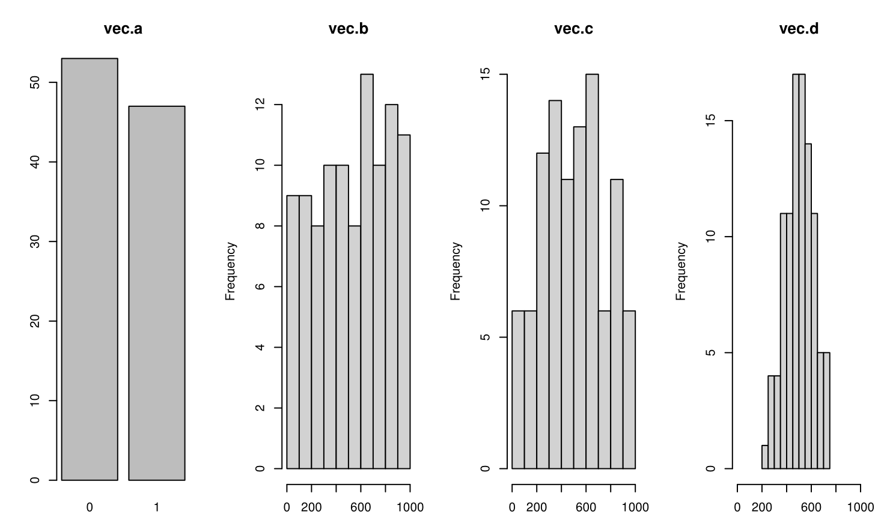
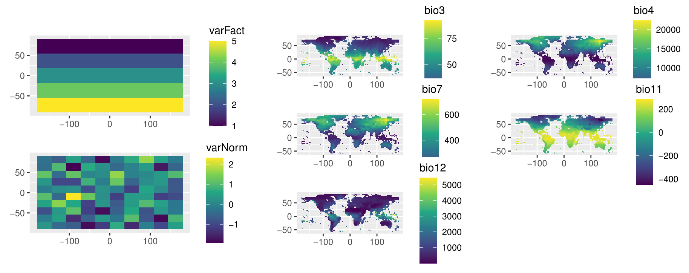

<link rel="stylesheet" href="https://cdnjs.cloudflare.com/ajax/libs/font-awesome/6.0.0/css/all.min.css" />


## <i class="fa-solid fa-code"></i> Small code examples

Here are presented, in small and unlinked examples, secondary functions (starting with `bm_[...]`) of `biomod2`. Most of these functions are internally called by some main functions (starting with `BIOMOD_[...]`) of `biomod2`, but can be easily used as such.


<br/><br/>


### <i class="fa-solid fa-truck-ramp-box"></i> Prepare data

#### <i class="fa-solid fa-bars"></i> Vector data

```R
## Generate a binary vector -------------------------------------------------------------
vec.a <- sample(c(0, 1), 100, replace = TRUE)

## Generate a 0-1000 vector (random drawing) --------------------------------------------
vec.b <- runif(100, min = 0, max = 1000)

## Generate a 0-1000 vector (biased drawing) --------------------------------------------
BiasedDrawing <- function(x, m1 = 300, sd1 = 200, m2 = 700, sd2 = 200) {
  return(ifelse(x < 0.5, rnorm(1, m1, sd1), rnorm(1, m2, sd2)))
}
vec.c <- sapply(vec.a, BiasedDrawing)
vec.c[which(vec.c < 0)] <- 0
vec.c[which(vec.c > 1000)] <- 1000

## Generate a 0-1000 vector (normal distribution) ---------------------------------------
vec.d <- rnorm(100, 500, 100)
```

<!-- png("vignettes/pictures/examples_2_plot1.png", width = 800, height = 300) -->
<!-- pdf("vignettes/pictures/examples_2_plot1.pdf", width = 8, height = 5) -->
<!-- par(mfrow = c(1, 4)) -->
<!-- barplot(table(vec.a), main = "vec.a") -->
<!-- hist(vec.b, main = "vec.b", xlab = "", xlim = c(0, 1000)) -->
<!-- hist(vec.c, main = "vec.c", xlab = "", xlim = c(0, 1000)) -->
<!-- hist(vec.d, main = "vec.d", xlab = "", xlim = c(0, 1000)) -->
<!-- dev.off() -->

<div style="text-align:center;">
<p></p>
</div>


#### <i class="fa-solid fa-eye"></i> Observations & explanatory variables

```R
library(biomod2)
library(terra)
```

```R
## Create simple simulated data ---------------------------------------------------------
myResp.sim <- sample(c(0, 1), 20, replace = TRUE)
myExpl.sim <- data.frame(var1 = sample(c(0, 1), 100, replace = TRUE),
                       var2 = rnorm(100),
                       var3 = 1:100)
                       
## Create raster data -------------------------------------------------------------------
ras.1 <- ras.2 <- mask.out <- rast(nrows = 10, ncols = 10)
ras.1[] <- as.factor(rep(c(1, 2, 3, 4, 5), each = 20))
ras.1 <- as.factor(ras.1)
ras.2[] <- rnorm(100)
stk <- c(ras.1, ras.2)
names(stk) <- c('varFact', 'varNorm')

## define a mask for already sampled points
mask.out[1:40] <- 1

## define a list of masks where we want to sample in priority
mask.in <- list(ras.1, ras.1)
mask.in[[1]][1:80] <- NA ## only level 5 should be sampled in this mask
mask.in[[1]][21:80] <- NA ## only levels 1 and 5 should be sampled in this mask

## Load real data ---------------------------------------------------------
data(DataSpecies)
myResp.real <- as.numeric(DataSpecies[, 'GuloGulo'])

data(bioclim_current)
myExpl.real <- rast(bioclim_current)

myCoord.real <- DataSpecies[, c('X_WGS84', 'Y_WGS84')]
myCoord.real.1 <- DataSpecies[which(myResp.real == 1), c('X_WGS84', 'Y_WGS84')]
myResp.real.raster <- classify(subset(myExpl.real, 1), 
                               matrix(c(-Inf, Inf, 0), ncol = 3))
myResp.real.raster[cellFromXY(myResp.real.raster, myCoord.real.1)] <- 1
```

<!-- library(foreach) -->
<!-- library(ggplot2) -->
<!-- library(patchwork) -->
<!-- pp.list = foreach(ras = list(stk$varFact, stk$varNorm, myExpl.real$bio3, myExpl.real$bio4 -->
<!--                              , myExpl.real$bio7, myExpl.real$bio11, myExpl.real$bio12)) %do% -->
<!--   { -->
<!--     df = as.data.frame(rasterToPoints(ras)) -->
<!--     pp = ggplot(df, aes_string(x = "x", y = "y", fill = colnames(df)[3])) + -->
<!--       geom_raster() + -->
<!--       coord_equal() + -->
<!--       labs(x = "", y = "") + -->
<!--       scale_fill_viridis_c() -->
<!--     return(pp) -->
<!--   } -->
<!-- pp1 = pp.list[[1]] / pp.list[[2]] -->
<!-- pp2 = pp.list[[3]] + pp.list[[4]] + pp.list[[5]] +  -->
<!--   pp.list[[6]] + pp.list[[7]] + plot_layout(ncol = 2) -->
<!-- pdf("vignettes/pictures/examples_2_plot2.pdf", width = 10, height = 8) -->
<!-- (pp1 | pp2) + plot_layout(ncol = 2, width = c(1, 2)) -->
<!-- dev.off() -->

<div style="text-align:center;">

</div>


<br/><br/>


### <i class="fa-solid fa-square-check"></i> Secondary functions : vector data

#### <i class="fa-solid fa-scissors"></i> Generate calibration / evaluation datasets

```R
bm_SampleBinaryVector(obs = vec.a, ratio = 0.7)
```

<!-- #### Rescale values between 0-1 with a binomial GLM -->

<!-- ```R -->
<!-- vec.b_rescaled <- bm_Rescaler(dataToRescale = vec.b, -->
<!--                               name = "TEST", -->
<!--                               doModel = TRUE, -->
<!--                               ref = vec.a) -->
<!-- plot(vec.b, vec.b_rescaled) -->
<!-- abline(a = 0, b = 0.001, lty = 2) -->
<!-- ``` -->

#### <i class="fa-solid fa-scale-balanced"></i> Find optimal threshold for a specific evaluation metric

```R
# varying the number of thresholds to test
bm_FindOptimStat(metric.eval = 'TSS', obs = vec.a, fit = vec.b, nb.thresh = 5)
bm_FindOptimStat(metric.eval = 'TSS', obs = vec.a, fit = vec.b, nb.thresh = 100)

# different metrics
bm_FindOptimStat(metric.eval = 'TSS', obs = vec.a, fit = vec.c)
bm_FindOptimStat(metric.eval = 'ROC', obs = vec.a, fit = vec.c)
bm_FindOptimStat(metric.eval = 'BOYCE', obs = vec.a, fit = vec.c)
```

#### <i class="fa-solid fa-filter"></i> From continuous to binary / filtered vector

```R
vec.d_bin <- bm_BinaryTransformation(data = vec.d, threshold = 500)
vec.d_filt <- bm_BinaryTransformation(data = vec.d, threshold = 500, do.filtering = TRUE)
cbind(vec.d, vec.d_bin, vec.d_filt)
```


<br/><br/>


### <i class="fa-solid fa-square-check"></i> Secondary functions : explanatory variables

#### <i class="fa-solid fa-subscript"></i> Generate automatic formula

```R
bm_MakeFormula(resp.name = 'myResp.sim',
               expl.var = head(myExpl.sim),
               type = 'quadratic',
               interaction.level = 0)
```

#### <i class="fa-solid fa-layer-group"></i> Sample all factor levels

```R
samp1 <- bm_SampleFactorLevels(expl.var = stk, mask.out = mask.out)
samp2 <- bm_SampleFactorLevels(expl.var = stk, mask.in = mask.in)
samp3 <- bm_SampleFactorLevels(expl.var = stk, mask.out = mask.out, mask.in = mask.in)
```

#### <i class="fa-solid fa-globe"></i> Compute Species Range Envelop model

```R
# Compute SRE for several quantile values
sre.100 <- bm_SRE(resp.var = myResp.real.raster,
                  expl.var = myExpl.real,
                  new.env = myExpl.real,
                  quant = 0)
sre.095 <- bm_SRE(resp.var = myResp.real.raster,
                  expl.var = myExpl.real,
                  new.env = myExpl.real,
                  quant = 0.025)
sre.090 <- bm_SRE(resp.var = myResp.real.raster,
                  expl.var = myExpl.real,
                  new.env = myExpl.real,
                  quant = 0.05)
  
# Visualize results
res <- c(myResp.real.raster, sre.100, sre.095, sre.090)
names(res) <- c("Original distribution", "Full data calibration", "Over 95 percent", "Over 90 percent")
plot(res, zlim = c(0, 1))
```

#### <i class="fa-solid fa-chart-column"></i> Compute variables importance

```R
mod <- glm(var1 ~ var2 + var3, data = myExpl.sim)
bm_VariablesImportance(bm.model = mod, 
                       expl.var = myExpl.sim[, c('var2', 'var3')],
                       method = 'full_rand',
                       nb.rep = 3)
```


<br/><br/>


### <i class="fa-solid fa-square-check"></i> Secondary functions : `biomod2` data

```R
# Format Data with true absences
myBiomodData <- BIOMOD_FormatingData(resp.var = myResp.real,
                                     expl.var = myExpl.real,
                                     resp.xy = myCoord.real,
                                     resp.name = 'Alien')
                                     
# Transform true absences into potential pseudo-absences
myResp.real.PA <- ifelse(myResp.real == 1, 1, NA)
myResp.real.PA.vect <- vect(cbind(myCoord.real, myResp.real.PA), geom = c('X_WGS84','Y_WGS84'))
```

#### <i class="fa-solid fa-shuffle"></i> Generate pseudo-absence datasets

```R
# random method
PA.r <- bm_PseudoAbsences(resp.var = myResp.real.PA.vect,
                          expl.var = myExpl.real,
                          nb.rep = 4,
                          nb.absences = 1000,
                          strategy = 'random')

# disk method
PA.d <- bm_PseudoAbsences(resp.var = myResp.real.PA.vect,
                          expl.var = myExpl.real,
                          nb.rep = 4,
                          nb.absences = 500,
                          strategy = 'disk',
                          dist.min = 5,
                          dist.max = 35)

# SRE method
PA.s <- bm_PseudoAbsences(resp.var = myResp.real.PA.vect,
                          expl.var = myExpl.real,
                          nb.rep = 4,
                          nb.absences = 1000,
                          strategy = 'sre',
                          sre.quant = 0.025)

# user.defined method
myPAtable <- data.frame(PA1 = ifelse(myResp.real == 1, TRUE, FALSE),
                        PA2 = ifelse(myResp.real == 1, TRUE, FALSE))
for (i in 1:ncol(myPAtable)) myPAtable[sample(which(myPAtable[, i] == FALSE), 500), i] = TRUE
PA.u <- bm_PseudoAbsences(resp.var = myResp.real.PA.vect,
                          expl.var = myExpl.real,
                          strategy = 'user.defined',
                          user.table = myPAtable)

str(PA.r)
head(PA.r$pa.tab)
apply(PA.r$pa.tab, 2, table)

head(PA.d$pa.tab)
apply(PA.d$pa.tab, 2, table)

head(PA.s$pa.tab)
apply(PA.s$pa.tab, 2, table)

tail(PA.u$pa.tab)
apply(PA.u$pa.tab, 2, table)
```

```R
# random method : different number of PA
PA.r_mult <- bm_PseudoAbsences(resp.var = myResp.real.PA.vect,
                               expl.var = myExpl.real,
                               nb.rep = 4,
                               nb.absences = c(1000, 500, 500, 200),
                               strategy = 'random')

str(PA.r_mult)
head(PA.r_mult$pa.tab)
apply(PA.r_mult$pa.tab, 2, table)
```


#### <i class="fa-solid fa-scissors"></i> Generate calibration / evaluation datasets

```R
# random selection
cv.r <- bm_CrossValidation(bm.format = myBiomodData,
                           strategy = 'random',
                           nb.rep = 3,
                           k = 0.8)

# k-fold selection
cv.k <- bm_CrossValidation(bm.format = myBiomodData,
                           strategy = 'kfold',
                           nb.rep = 2,
                           k = 3)

# block selection
cv.b <- bm_CrossValidation(bm.format = myBiomodData,
                           strategy = 'block')

# stratified selection (geographic)
cv.s <- bm_CrossValidation(bm.format = myBiomodData,
                           strategy = 'strat',
                           k = 2,
                           balance = 'presences',
                           strat = 'x')

# stratified selection (environmental)
cv.e <- bm_CrossValidation(bm.format = myBiomodData,
                           strategy = 'env',
                           k = 2,
                           balance = 'presences')

head(cv.r)
apply(cv.r, 2, table)
head(cv.k)
apply(cv.k, 2, table)
head(cv.b)
apply(cv.b, 2, table)
head(cv.s)
apply(cv.s, 2, table)
head(cv.e)
apply(cv.e, 2, table)
```


#### <i class="fa-solid fa-rectangle-list"></i> Retrieve modeling options

All models currently available in `biomod2` (and their related package and function) are listed within a small dataset. Some of them can be tuned through the `train` function of the `caret` package and corresponding training function to be used is also indicated.

```R
data(ModelsTable)
ModelsTable
```

```R
allModels <- c('ANN', 'CTA', 'FDA', 'GAM', 'GBM', 'GLM'
               , 'MARS', 'MAXENT', 'MAXNET', 'RF', 'SRE', 'XGBOOST')

# default parameters
opt.d <- bm_ModelingOptions(data.type = 'binary',
                            models = allModels,
                            strategy = 'default')

# providing formated data
opt.df <- bm_ModelingOptions(data.type = 'binary',
                             models = allModels,
                             strategy = 'default',
                             bm.format = myBiomodData,
                             calib.lines = cv.k)

opt.d
opt.d@models
opt.d@options$ANN.binary.nnet.nnet
names(opt.d@options$ANN.binary.nnet.nnet@args.values)

opt.df@options$ANN.binary.nnet.nnet
names(opt.df@options$ANN.binary.nnet.nnet@args.values)
```

```R
# bigboss parameters
opt.b <- bm_ModelingOptions(data.type = 'binary',
                            models = allModels,
                            strategy = 'bigboss')

# user defined parameters
user.SRE <- list('_allData_allRun' = list(quant = 0.01))
user.XGBOOST <- list('_allData_allRun' = list(nrounds = 10))
user.val <- list(SRE.binary.biomod2.bm_SRE = user.SRE
                 , XGBOOST.binary.xgboost.xgboost = user.XGBOOST)

opt.u <- bm_ModelingOptions(data.type = 'binary',
                            models = c('SRE', 'XGBOOST'),
                            strategy = 'user.defined',
                            user.val = user.val)

opt.b
opt.u
```

```R
# tune parameters for Random Forest model
tuned.rf <- bm_Tuning(model = 'RF',
                      tuning.fun = 'rf', ## see in ModelsTable
                      do.formula = TRUE,
                      bm.options = opt.d@options$RF.binary.randomForest.randomForest,
                      bm.format = myBiomodData)
tuned.rf ## list object

# tune parameters for GAM (from mgcv package) model
tuned.gam <- bm_Tuning(model = 'GAM',
                       tuning.fun = 'gam', ## see in ModelsTable
                       do.formula = TRUE,
                       do.stepAIC = TRUE,
                       bm.options = opt.d@options$GAM.binary.mgcv.gam,
                       bm.format = myBiomodData)
tuned.gam ##list object

                              
# tuned parameters with formated data
opt.t <- bm_ModelingOptions(data.type = 'binary',
                            models = c('SRE', 'XGBOOST'),
                            strategy = 'tuned',
                            bm.format = myBiomodData)

opt.t ## BIOMOD.modeling.options object
```
