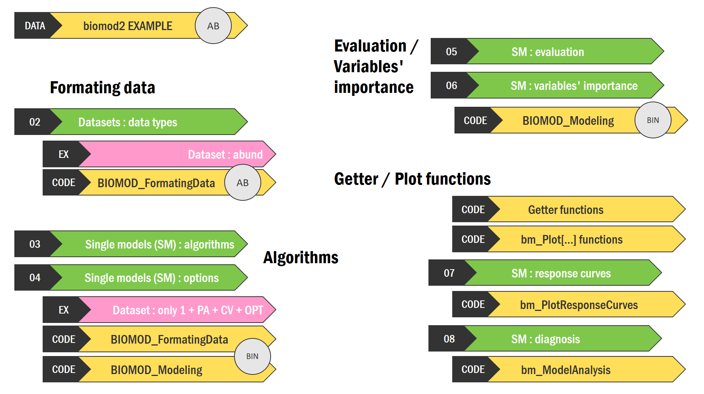
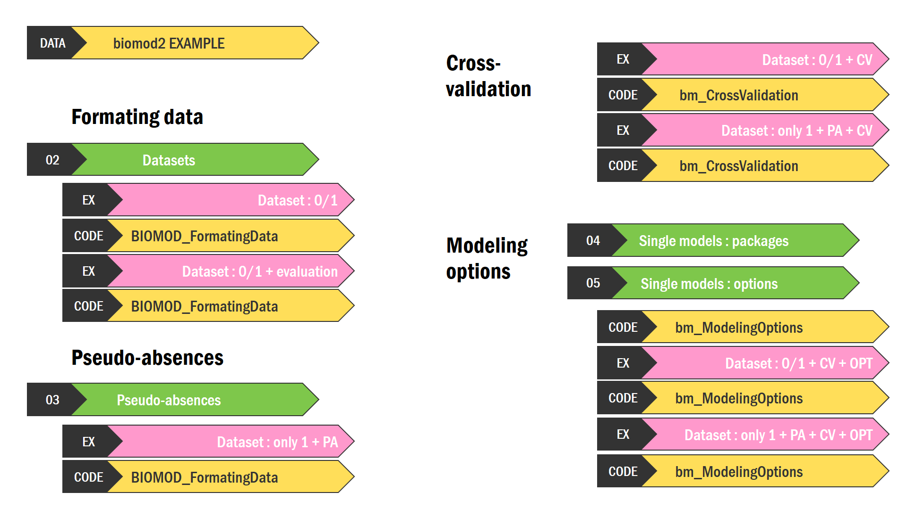

<link rel="stylesheet" href="https://cdnjs.cloudflare.com/ajax/libs/font-awesome/7.0.1/css/all.min.css" integrity="sha512-2SwdPD6INVrV/lHTZbO2nodKhrnDdJK9/kg2XD1r9uGqPo1cUbujc+IYdlYdEErWNu69gVcYgdxlmVmzTWnetw==" crossorigin="anonymous" referrerpolicy="no-referrer" />

### biomod2 team videos

1. *All first steps of your biomod2 modeling, going from formatting of your data, to defining of your modeling options, through pseudo-absences and cross-validation data sets.*  
2. *All information about single models within biomod2, introducing data types and algorithms, and exploring evaluation metrics, variables' importance and response curves.*

*Chapters can be directly accessed to through time stamps in the video description on YouTube.*

#### Tutorial 2 - v4.3-4 - part 1 

<iframe width="560" height="315" src="https://www.youtube.com/embed/FQ9b_k73zR4?si=aZSF7h12l7o5WcuJ" title="biomod2 v4.3-4 tutorial - part 1" frameborder="0" allow="accelerometer; autoplay; clipboard-write; encrypted-media; gyroscope; picture-in-picture" allowfullscreen></iframe>

 

| Chapter                      | Theme                         | Timestamp |
| :--------------------------- | :-------------------------------- | ----: |
| Evolution through time       |                                   |  0:00 |
|                              |  01. Functions hierarchy          |  1:00 |
|                              |  DATA. biomod2 example (BIN / AB) |  1:32 |
| FORMATING DATA               |                                   |  2:33 |
|                              |  02. Datasets : data types        |  3:19 |
|                              |  Dataset : abund                  |  4:38 |
| ALGORITHMS                   |                                   |  5:49 |
|                              |  03. Single models : algorithms   |  6:51 |
|                              |  04. Single models : options      |  9:00 |
|                              |  Dataset : only 1 + PA + CV + OPT (BIN)    | 10:28 |
| EVALUATION / VARIABLES' IMPORTANCE |  05. Single models : evaluation      | 15:10 |
|                              |  06. Single models : variables' importance | 19:38 |
|                              |  Code : BIOMOD_Modeling(BIN)      | 22:38 |
| GETTER / PLOT FUNCTIONS      |                                   | 23:41 |
|                              |  Code : Getter functions          | 24:49 |
|                              |  Code : Plot functions            | 29:09 |
|                              |  07. Single models : response curves       | 32:47 |
|                              |  08. Single models : diagnosis             | 36:43 |

#### Tutorial 1 - v4.2-6

<iframe width="560" height="315" src="https://www.youtube.com/embed/ofAKTkDvmkg?si=hVKdPHnDLlRHpnld" title="biomod2 v4.2-6 tutorial 1" frameborder="0" allow="accelerometer; autoplay; clipboard-write; encrypted-media; gyroscope; picture-in-picture" allowfullscreen></iframe>

 

| Chapter                      | Theme                         | Timestamp |
| :--------------------------- | :-------------------------------- | ----: |
| Introduction to the package  |                                   |  0:00 |
|                              |  01. Functions hierarchy          |  2:28 |
|                              |  DATA. biomod2 example            |  3:54 |
| FORMATING DATA               |  02. Datasets                     |  4:14 |
|                              |  Dataset : 0/1                    |  7:07 |
|                              |  Dataset : 0/1 + evaluation       |  8:21 |
| PSEUDO-ABSENCES              |                                   |  9:08 |
|                              |  03. Pseudo-absences              |  9:39 |
|                              |  Dataset : only 1 + PA            | 13:05 |
| CROSS-VALIDATION             |  Dataset : 0/1 + CV               | 16:35 |
|                              |  Dataset : only 1 + PA + CV       | 18:39 |
| MODELING OPTIONS             |  04. Single models : packages     | 19:49 |
|                              |  05. Single models : options      | 20:26 |
|                              |  Dataset : 0/1 + CV + OPT         | 24:48 |
|                              |  Dataset : only 1 + PA + CV + OPT | 26:40 |
