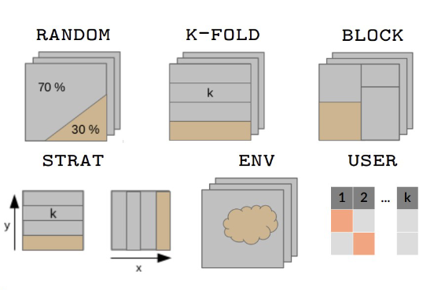

<link rel="stylesheet" href="https://cdnjs.cloudflare.com/ajax/libs/font-awesome/7.0.1/css/all.min.css" integrity="sha512-2SwdPD6INVrV/lHTZbO2nodKhrnDdJK9/kg2XD1r9uGqPo1cUbujc+IYdlYdEErWNu69gVcYgdxlmVmzTWnetw==" crossorigin="anonymous" referrerpolicy="no-referrer" />

### <i class="fa-solid fa-address-card"></i> Definition

Whether independent data is available or not (`eval.[...]` parameters in [BIOMOD_FormatingData](../reference/BIOMOD_FormatingData.html)), **data-splitting** methods allow to divide input data into pieces to **calibrate** and **validate** the models on different parts.

The general idea behind is to assess how much a model is *stable* (low variability of results when changing the data), *accurate* (for predictions) and *able to predict new data* (to flag problems like overfitting or selection bias).

**Note** that there are pros and cons to the different methods, that can be dependent on your data and sampling.

<br/><br/> 

### <i class="fa-solid fa-scissors"></i> How to split data ? - Methods

5 different methods are implemented within `biomod2` to split data through either [bm_CrossValidation](../reference/bm_CrossValidation.html) or [BIOMOD_Modeling](../reference/BIOMOD_Modeling.html).

Most common procedures split randomly the original dataset either :

1. **random** : in `2` parts with higher proportion for the calibration part (adjusted with `perc`)
2. **kfold** : or in `k` data sets of equal sizes: <br/> each part is successively used for the validation while the other `k-1` parts are used for the calibration, <br/> leading to `k` calibration/validation sets.

For both methods, the splitting can be repeated several times (`nb.rep`).

Other procedures are available to test for model overfitting and to assess transferability either in geographic space :

3. **block** : partitions data in `4` bins of equal size (*bottom-left, bottom-right, top-left and top-right*) ([Muscarella et al. 2014](vignette_crossValidation.html#references))
4. **strat** : uses `k` partitions along the `x-` (or `y-`) gradient and returns `2k` partitions ([Wenger and Olden 2012](vignette_crossValidation.html#references))

or environmental space :

5. **env** : returns `k` partitions for each environmental variable provided

These methods can be balanced over presences or absences to ensure equal distribution over space, especially if some data is clumped on an edge of the study area.  

<div style="text-align:center;">
<p></p>
</div>

**Note** that it is also possible for the user to define its own data partitioning.

<br/><br/> 

### <i class="fa-solid fa-list-check"></i> Calibration / Validation - Evaluation

Here is the terminology used within `biomod2` regarding data sets and their use.

<br/>

The *original* data set, given to the [BIOMOD_FormatingData](../reference/BIOMOD_FormatingData.html) function, is the one being split by cross-validation method in 2. <br/>
**Calibration** is the part used to build the model, while **validation** is the remaining part used to project the model onto and compute metrics to assess model's quality.

A second *optional* data set can be given through `eval.[...]` parameters in [BIOMOD_FormatingData](../reference/BIOMOD_FormatingData.html) : the **evaluation** part. <br/>
It is only used to project the model onto and compute metrics to asses model's quality and extrapolation capacity. <br/>
The evaluation part is never split and all its data is always used.

**Note** that you will find this notation in the table returned by the [get_evaluations](../reference/getters.out.html) function.

<br/>

**Regarding ensemble modeling**, predictions of some single models are gathered together to obtain one ensemble prediction. <br/>
But depending on the way single models are combined (`em.by` parameter in [BIOMOD_EnsembleModeling](../reference/BIOMOD_EnsembleModeling.html)), they may not rely on the same calibration part of the original data.

- Example of same calibration : *all RUN1 models using different pseudo-absence data sets, or different algorithms.*
- Example of different calibration : *all GLM + PA1 models using different calibration / validation data sets.*

In consequence, there are 2 cases :

1. `em.by = 'PA+run'` : one ensemble model is built for each cross-validation fold. <br/> It means that you will have metric values at the ensemble level **for both calibration and validation parts**.

2. `em.by` is either `all`, `algo`, `PA`, `PA+algo` : single models with different cross-validation fold are merged together. <br/> As calibration and validation parts do not match anymore, all data is used to compute metrics : you will have metric values at the ensemble level **only for calibration column**.

<br/><br/> 

### <i class="fa-solid fa-circle-info"></i> Specifications

Cross-validation tables returned by [bm_CrossValidation](../reference/bm_CrossValidation.html) and [get_calib_lines](../reference/getters.out.html) functions, or accepted by `CV.user.table` parameter in [BIOMOD_Modeling](../reference/BIOMOD_Modeling.html) when `CV.strategy = 'user.defined'` :

- contain `TRUE`, `FALSE` or `NA` values :
    + `TRUE` standing for observations to be included in the calibration part
    + `FALSE` standing for observations to be included in the validation part
    + `NA` used when building pseudo-absence sets with different sizes

- as many columns as single models will be built for each selected algorithm

- column names formatted as :
    + for presence-absence / abundance data : `_allData_RUNy` with `y` the cross-validation fold
    + for presence-only data : `_PAx_RUNy` with `x` the pseudo-absence set and `y` the cross-validation fold

| _PA1_RUN1 | _PA1_RUN2 | _PA2_RUN1 | _PA2_RUN2 |
| --------- | --------- | --------- | --------- |
| FALSE     | FALSE     | FALSE     | TRUE      |
| TRUE      | TRUE      | FALSE     | FALSE     |
| TRUE      | TRUE      | TRUE      | TRUE      |
| ...       | ...       | ...       | ...       |

<br/>

**Note** that it is possible to provide your cross-validation table to the [plot](../reference/plot.html) function of a `BIOMOD.formated.data` object to visualize both observations and PA / cross-validation sets :

```R
myCalibLines <- get_calib_lines(myBiomodModelOut)
plot(myBiomodData, calib.lines = myCalibLines)
```
<div style="text-align:center;">
<p></p>
</div>

<br/>

<div style="text-align:center;">
See code examples : 

[MAIN functions, BINARY data, section **Prepare data & parameters / Cross-validation datasets**](examples_1_mainFunctions_BIN.html#cross-validation-datasets) <br/>
[MAIN functions, ABUNDANCE data, section **Prepare data & parameters / Cross-validation datasets**](examples_1_mainFunctions_AB.html#cross-validation-datasets)

[AUXILIARY functions, section **Auxiliary functions : biomod2 data / Generate calibration - evaluation datasets**](examples_2_auxiliaryFunctions.html#generate-calibration-evaluation-datasets-1)
</div>


<br/><br/> 


### <i class="fa-solid fa-book-bookmark"></i> References

- Muscarella R, Galante PJ, Soley-Guardia M, Boria RA, Kass JM, Uriarte M, Anderson RP (**2014**). *ENMeval: An R package for conducting spatially independent evaluations and estimating optimal model complexity for Maxent ecological niche models.* Methods in Ecology and Evolution, 5, 1198-1205. [10.1111/2041-210X.12261](https://doi.org/10.1111/2041-210X.12261)
- Wenger SJ and Olden JD (**2012**). *Assessing transferability of ecological models: an underappreciated aspect of statistical validation.* Methods in Ecology and Evolution, 3, 260-267. [10.1111/j.2041-210X.2011.00170.x](https://doi.org/10.1111/j.2041-210X.2011.00170.x)

