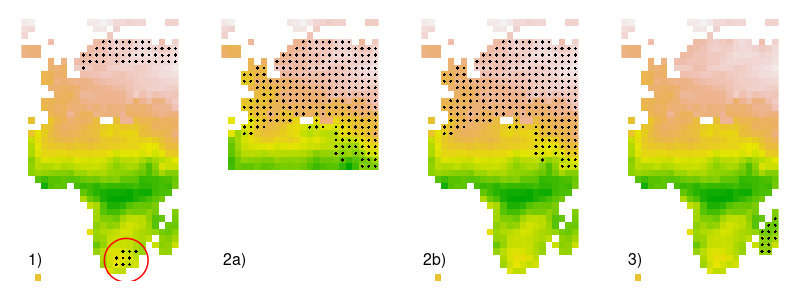

<link rel="stylesheet" href="https://cdnjs.cloudflare.com/ajax/libs/font-awesome/6.0.0/css/all.min.css" />

## <i class="fa-solid fa-circle-question"></i> Small preliminary questions

`biomod2` functions, as any statistical function, will run *as long as the data provided matches the functions requirements*, e.g. coordinate points associated with variable values.
BUT **the reliability of the data and the assumptions behind it** mostly depend on the attention of the modeler.

Here are some questions that one's modeler should ask himself before starting his modeling.

  

### <i class="fa-solid fa-eye"></i> Observations & Explanatory variables

#### <i class="fa-solid fa-location-dot"></i> Geographical distribution

<!-- library(terra) -->
<!-- library(plotrix) -->

<!-- # load environment -->
<!-- data("bioclim_current") -->
<!-- myExpl.real <- rast(bioclim_current) -->
<!-- myExpl.crop <- crop(myExpl.real, ext(c(-20, 50, -40, 80))) -->
<!-- myMap <- myExpl.crop[[1]] -->

<!-- # load occurrences -->
<!-- data("DataSpecies") -->

<!-- png("vignettes/pictures/dataPreparation_plot1.png", width = 800, height = 300) -->
<!-- par(mfrow = c(1, 4)) -->

<!-- # case1 : outliers -->
<!-- plot(myMap, asp = 1, legend = FALSE, axes = FALSE) -->
<!-- points(DataSpecies[which(DataSpecies$GuloGulo == 1), 1:2], pch = 18) -->
<!-- points(DataSpecies[which(DataSpecies$ConnochaetesGnou == 1), 1:2], pch = 18) -->
<!-- draw.circle(x = 27, y = -30, radius = 10, border = 'red', lwd = 2) -->
<!-- text(x = -15, y = -30, labels = "1)", cex = 2) -->

<!-- # case2 : study area -->
<!-- myMap_bis <- myMap -->
<!-- myMap_bis[cellFromRowColCombine(myMap, rowFromY(myMap, 10):nrow(myMap), 1:ncol(myMap))] <- NA -->
<!-- plot(myMap_bis, asp = 1, legend = FALSE, axes = FALSE) -->
<!-- points(DataSpecies[which(DataSpecies$VulpesVulpes == 1), 1:2], pch = 18) -->
<!-- text(x = -15, y = -30, labels = "2a)", cex = 2) -->

<!-- plot(myMap, asp = 1, legend = FALSE, axes = FALSE) -->
<!-- points(DataSpecies[which(DataSpecies$VulpesVulpes == 1), 1:2], pch = 18) -->
<!-- text(x = -15, y = -30, labels = "2b)", cex = 2) -->

<!-- # case3 : sampling bias -->
<!-- plot(myMap, asp = 1, legend = FALSE, axes = FALSE) -->
<!-- points(DataSpecies[which(DataSpecies$TenrecEcaudatus == 1), 1:2], pch = 18) -->
<!-- text(x = -15, y = -30, labels = "3)", cex = 2) -->
<!-- dev.off() -->

**Outliers :** *are some points really distant from the others ? if yes, why ?*

In example 1), the main distribution of the species seem to be in northern Europe, but some points occur in South Africa. It will be good to check if these points are correct, or due to error in coordinates or sampling.

 

**Study area / resolution :** *what is the finer scale to represent the occurrences ?*

Species in example 2) is widely dispersed within Europe. Extent 2a) will not be sufficient to model the niche of the species as some environmental conditions might be missing (species present elsewhere) or not enough different from the ones in which the species is present. Extent 2b) would be more appropriate to also take into account environmental conditions not favorable for the species.

 

**Sampling bias :** *is there bias in the points sampling ?*

Species in example 3) is only present in Madagascar. Is this species really endemic of this Island ? Or is there a specific sampling program in Madagascar while the species is also present on the continent nearby ?

 

#### <i class="fa-solid fa-map"></i> Environmental distribution

**Ecology of the species :** *what is known about the species preferences in terms of habitat ?*

For example, western green lizard (*Lacerta bilineata*) is found (according to Wikipedia) in :

- green humid areas,
- temperate forest,
- the edges of woods,
- shrubland, open grassland, arable land, and pastureland.

**Representativeness :** *do the available variables reflect these preferences ?*

If *precipitations* could reflect the humidity of habitats, variables such as "*is the environment open or closed*", or *percentage of habitat types* would be a plus. However, are those variables available, and at which resolution ? On the contrary, *slope* or *soil type* would be non-interesting here for this species.

  

**NOTE** that it is ALWAYS a good starting point to LOOK, PLOT, SUMMARIZE the data that is going to be used (occurrences, variables...).

  

### <i class="fa-solid fa-route"></i> Modeling choices

**Study area / resolution :** *at which resolution and extent are available the variables ? how many pixels and how heavy are the maps ?*

- Are all the variables of interest available for the whole extent of the study area ?   (for example, CORINE Land Cover is available over Europe only so it could not be used if modeling over both Europe and Africa)
- If Madagascar is chosen as study area, resolution should be finer than 100km x 100km (in order to have enough pixels) but coarser than 10m x 10m (in order to have meaningful modeling, variables matching this resolution, and to be able to run computation)

**Note** that no matter how much the data is good, if it is too heavy and the computer can not load it, models and projections will NEVER be produced.

 

**Occurrences / background data :** *do occurrences need to be thinned ? to be corrected for sampling bias ? how pseudo-absences must be selected if needed ?*

Species distribution models build statistical relationships between presence and absence points and their corresponding environmental values. As any statistical method, it requires a minimum number of points to work and provide (enough) reliable results. Common arbitrary rule is to have at the very least 10 occurrences for each variable added in the model (e.g. if 6 variables are used, 6 * 10 = 60 occurrences should be available).

Sometimes, if the variable resolution is coarser than the sampling resolution, occurrences will be redundant and some will need to be removed (e.g. if 30 occurrences are available, but 10 of them fall into the same pixel, these 10 should count as 1).

On the contrary, if effort sampling is higher in some places than other, thinning occurrences might be useful to get rid of spatial autocorrelation (e.g. few points are available in French Alps, but a lot of them in Swiss Alps, and only points distant from 10km to each other will be kept).

If no absence data is available for the modeling species, pseudo-absences will be needed and more informations can be found in the corresponding [vignette on pseudo-absences](vignette_pseudoAbsences.html).

 

**Correlation :** *are variables correlated between them ? if yes, which ones are to be kept ?*

It is USELESS to put too many variables into a model :

- as said above, the more the variables, the more occurrences needed
- and the more the variables, the more likely they are to be correlated to each other

Correlated variables in one model will only reduce the signal of which variable is truly important or not (if A and B are correlated, sometimes it will be A selected and sometimes B).
Selecting variables *a priori* is absolutely necessary to guide the model in first step, improve computation of variables' importance and put ecological hypotheses down on paper.

