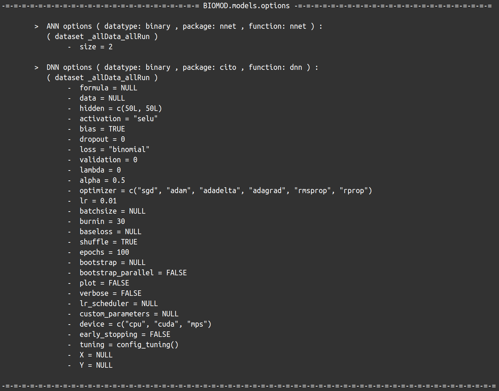
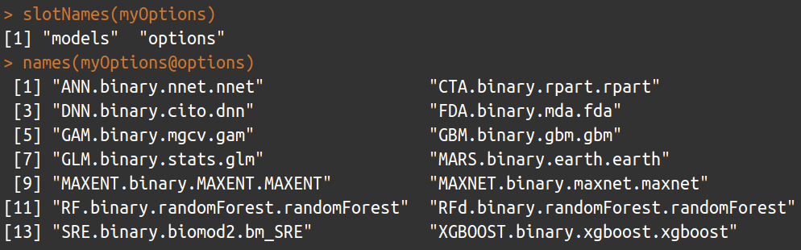

<link rel="stylesheet" href="https://cdnjs.cloudflare.com/ajax/libs/font-awesome/7.0.1/css/all.min.css" integrity="sha512-2SwdPD6INVrV/lHTZbO2nodKhrnDdJK9/kg2XD1r9uGqPo1cUbujc+IYdlYdEErWNu69gVcYgdxlmVmzTWnetw==" crossorigin="anonymous" referrerpolicy="no-referrer" />

### <i class="fa-solid fa-phone"></i> How it works ?

`biomod2` is working as a wrapper, calling external packages to use their single model functions. Modeling options are automatically retrieved from these packages, allowing the use of all arguments taken into account by these functions.

**Note** that there are 2 exceptions : the Surface Range Envelop (SRE) model, which is directly coded within `biomod2` package, and MAXENT java software, whose executable file is required in the simulation folder to be used.


<div style="text-align:center;">
<p></p>
</div>

<br/><br/> 

### <i class="fa-regular fa-id-card"></i> Model ID name

All this information, about which single models are available, from which package they come from, which function is called, is stored within the [ModelsTable](../reference/ModelsTable.html) data object :

```R
     model      type      package         func       train
     
1      ANN    binary         nnet         nnet      avNNet
2      CTA    binary        rpart        rpart       rpart
3      DNN    binary         cito          dnn        tune
4      FDA    binary          mda          fda         fda
5      GAM    binary          gam          gam    gamLoess
6      GAM    binary         mgcv          bam         bam
7      GAM    binary         mgcv          gam         gam
8      GBM    binary          gbm          gbm         gbm
9      GLM    binary        stats          glm         glm
10    MARS    binary        earth        earth       earth
11  MAXENT    binary       MAXENT       MAXENT ENMevaluate
12  MAXNET    binary       maxnet       maxnet      maxnet
13      RF    binary randomForest randomForest          rf
14     RFd    binary randomForest randomForest          rf
15     SRE    binary      biomod2       bm_SRE      bm_SRE
16 XGBOOST    binary      xgboost      xgboost     xgbTree

17     CTA nonbinary        rpart        rpart       rpart
18     DNN nonbinary         cito          dnn        tune
19     FDA nonbinary          mda          fda         fda
20     GAM nonbinary          gam          gam    gamLoess
21     GAM nonbinary         mgcv          bam         bam
22     GAM nonbinary         mgcv          gam         gam
23     GBM nonbinary          gbm          gbm         gbm
24     GLM nonbinary        stats          glm         glm
25    MARS nonbinary        earth        earth       earth
26      RF nonbinary randomForest randomForest          rf
27 XGBOOST nonbinary      xgboost      xgboost     xgbTree
```

The **ID name** of each single models corresponds to the concatenation of the `model`, `package`, `func` and `train` columns. <br/> *For example : `ANN.nnet.nnet.avNNet` for the Artificial Neural Network model.* 

The `type` column specifies the data category, and some models can be used for both possible cases :

- *binary*, which relates to **presence-absence** and **presence-only** data (`data.type = 'binary'` in [BIOMOD_FormatingData](../reference/BIOMOD_FormatingData.html))
- *nonbinary*, which relates to all **abundance** data (`count`, `multiclass`, `ordinal`, `relative`, `abundance`)

<br/><br/> 

### <i class="fa-solid fa-rectangle-list"></i> Set modeling options

#### <i class="fa-solid fa-vial"></i> Default

[bm_ModelingOptions](../reference/bm_ModelingOptions.html) function returns for each selected single model both its informations and its **default** parameter values retrieved from its corresponding package.

```R
myOptions <- bm_ModelingOptions(data.type = 'binary', strategy = 'default')
myOptions
slotNames(myOptions)
names(myOptions@options)
```

<div style="text-align:center;">
<p></p>
<p></p>
<p></p>
</div>

**Note** that some values are modified internally after retrieval to ensure `biomod2` proper functioning. However, this represents minimum service and this strategy will often lead to bad models or even some errors, as default values are often non-adapted to species distribution modeling in general, and to specific dataset in particular.

**Note** that **MAXENT** is a special case. As being called directly through its java executable software, the recovery of parameters is not automatic as for other algorithms relying on R packages and functions. Hence, the *set of available parameters for MAXENT is fixed*, and can be consulted within the documentation of [bm_ModelingOptions](../reference/bm_ModelingOptions.html#note-1) function.

<br/>

#### <i class="fa-solid fa-vial-virus"></i> Bigboss

**bigboss** is a modified set, provided by `biomod2` team, tends to correct at least the species distribution aspect. All parameter values for all single models are available within the [OptionsBigboss](../reference/OptionsBigboss.html) data object.

```R
myOptions <- bm_ModelingOptions(data.type = 'binary', strategy = 'bigboss')
myOptions
```

<div style="text-align:center;">
<p></p>
</div>

**Note** that this is still a general solution, not necessarily adapted to your data, and can show no significative improvements.

<br/>

#### <i class="fa-solid fa-vial-circle-check"></i> Tuned

With **tuned** options, some algorithms can be trained over your data sets, mostly using the [`caret`](http://topepo.github.io/caret/) package which calls a specific function to tune each model (see `train` column in `ModelsTable`). With the exception of SRE, which is internally optimized, and MAXENT, which can be tuned thanks to the `ENMevaluate` function from [`ENMeval`](https://jamiemkass.github.io/ENMeval/) package.

Here is the list of the parameters that can be tuned when calling [bm_Tuning](../reference/bm_Tuning.html) :

| algorithm     | parameters                                                                                 |
| --------------| :------------------------------------------------------------------------------------------|
| ANN           | `size`, `decay`, `bag`                                                                     |
| DNN           | `hidden`, `bias`, `lambda`, `alpha`, `lr`, `batchsize`, `epochs`                           |
| FDA           | `degree`, `nprune`                                                                         |
| GAM           | `select`, `method`, `span`, `degree`                                                       |
| GBM           | `n.trees`, `interaction.depth`, `shrinkage`, `n.minobsinnode`                              |
| MARS          | `degree`, `nprune`                                                                         |
| MAXENT        | `algorithm`, `parallel`, `tune.args`, `partitions`, `kfolds`, `user.grp`                   |
| RF            | `mtry`                                                                                     |
| RFd           | `mtry`                                                                                     |
| SRE           | `quant`                                                                                    |
| XGBOOST       | `nrounds`, `max_depth`, `eta`, `gamma`, `colsampl_bytree`, `min_child_weight`, `subsample` |

For almost all algorithms (except `MAXENT`, `MAXNET` and `SRE`), you can choose to **optimize the formula** by setting `do.formula = TRUE`, testing for different type (`simple`, `quadratic`, `polynomial`, `s_smoother`) and interaction level.

In the same way, **variable selection** can be run for `GLM` and `GAM` if `do.stepAIC = TRUE` (with `MASS::stepAIC` and `gam::step.Gam` functions respectively).

```R
myTuning <- bm_Tuning(model = 'RF',
                      tuning.fun = 'rf', ## see in ModelsTable
                      do.formula = FALSE,
                      bm.options = myOptions@options$RF.binary.randomForest.randomForest,
                      bm.format = myBiomodData)
myTuning
```

<div style="text-align:center;">
<p></p>
</div>

<br/>

#### <i class="fa-solid fa-flask-vial"></i> User-defined

The `user.defined` option allows to adjust yourself all algorithm parameters, which means it can be a mix of everything :

- default or bigboss options, through `user.base` parameter
- tuning of some algorithms
- manually defined parameter values, through `user.val` parameter

<br/>

**Example :** *run 3 single models (`RF`, `GLM` and `MARS`), using the `bigboss` parameters as a basis and adapting them as much as possible to the data and cross-validation parts*

```R
## Create 2 sets of random splitting
myBiomodCV <- bm_CrossValidation(bm.format = myBiomodData,
                                 strategy = 'random',
                                 nb.rep = 2,
                                 perc = 0.8)

## ----------------------------------------------------------------------------------- ##
## Extract bigboss parameters for the 3 models
## Provide formated data (for formula)
## Provide cross-validation table (to duplicate settings for each set)
opt.BB  <- bm_ModelingOptions(data.type = 'binary',
                              models = c('RF', 'GLM', 'MARS'),
                              strategy = 'bigboss',
                              bm.format = myBiomodData, 
                              calib.lines = myBiomodCV)

## ----------------------------------------------------------------------------------- ##
## Tune RF parameters for each data set
tuned.RF <- bm_Tuning(model = 'RF',
                      tuning.fun = 'rf', ## see in ModelsTable
                      do.formula = TRUE,
                      bm.options = opt.BB@options$RF.binary.randomForest.randomForest,
                      bm.format = myBiomodData, 
                      calib.lines = myBiomodCV)

## ----------------------------------------------------------------------------------- ##
## Update GLM formula
## Apply it to both calibration sets
form.GLM <- bm_MakeFormula(resp.name = myBiomodData@sp.name,
                           expl.var = head(myBiomodData@data.env.var),
                           type = 'quadratic',
                           interaction.level = 2)
user.GLM <- list('_allData_RUN1' = list(formula = form.GLM),
                 '_allData_RUN2' = list(formula = form.GLM))

## ----------------------------------------------------------------------------------- ##
## Gather in one list modified parameters
## Models names can be found in OptionsBigboss@models
user.val <- list(RF.binary.randomForest.randomForest = tuned.RF,
                 GLM.binary.stats.glm = user.GLM)

## Create the final modeling options set
## Using bigboss as base (user.base)
## Updating some elements (user.val)
myOptions <- bm_ModelingOptions(data.type = 'binary',
                                models = c('RF', 'GLM', 'MARS'),
                                strategy = 'user.defined',
                                user.val = user.val,
                                user.base = 'bigboss',
                                bm.format = myBiomodData, 
                                calib.lines = myBiomodCV)
                            
print(myOptions)
print(myOptions, dataset = '_allData_RUN1')
print(myOptions, dataset = '_allData_RUN2')

## ----------------------------------------------------------------------------------- ##
## Give this final modeling options set to the modeling function
myBiomodModelOut <- BIOMOD_Modeling(bm.format = myBiomodData,
                                    modeling.id = 'Example',
                                    models = c('RF', 'GLM', 'MARS'),
                                    CV.strategy = 'user.defined',
                                    CV.user.table = myBiomodCV,
                                    OPT.user = myOptions,
                                    metric.eval = c('TSS', 'ROC', 'BOYCE'))

get_options(myBiomodModelOut)
```

<br/><br/>


<div style="text-align:center;">
See code examples : 

[MAIN functions, BINARY data, section **Prepare data & parameters / Retrieve modeling options**](examples_1_mainFunctions_BIN.html#retrieve-modeling-options) <br/>
[MAIN functions, ABUNDANCE data, section **Prepare data & parameters / Retrieve modeling options**](examples_1_mainFunctions_AB.html#retrieve-modeling-options)

[AUXILIARY functions, section **Auxiliary functions : biomod2 data / Retrieve modeling options**](examples_2_auxiliaryFunctions.html#retrieve-modeling-options)
</div>

