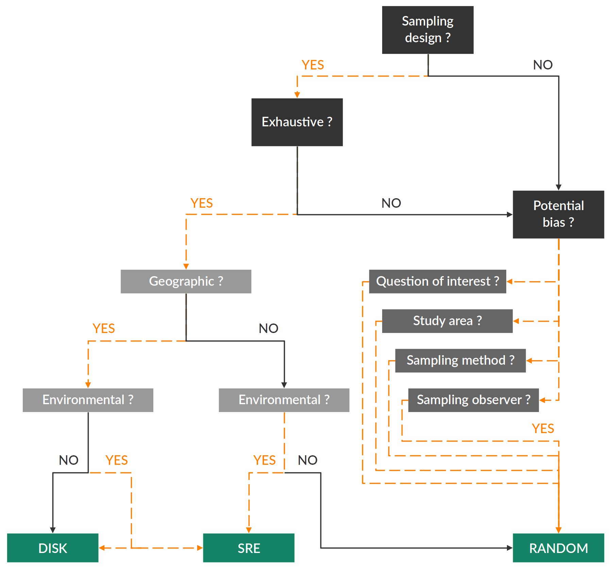

<link rel="stylesheet" href="https://cdnjs.cloudflare.com/ajax/libs/font-awesome/6.0.0/css/all.min.css" />

### <i class="fa-solid fa-address-card"></i> Definition

When using `data.type = 'binary'` in [BIOMOD_FormatingData](../reference/BIOMOD_FormatingData.html), `biomod2` requires either **presence / absence data**, or **presence-only data supplemented with pseudo-absences**. These pseudo-absences can be generated with the same function.

The general idea behind is to select points in the studied area that will be used to compare observed environment (represented by the presences) against what is available. Those points are NOT to be considered as absences, and rather represent the available environment. From a semantic point of view, several terms can be encountered in the literature for similar purposes : *pseudo-absences* ; and *background data* when it comes to MaxEnt mostly, or *quadrature points* when applying point-process model (PPM). These last two differ from pseudo-absences in the fact that they allow presence points to be selected as well, while pseudo-absences can not be selected over coordinates matching an observation.

**Note** that it is NOT allowed to mix both absences and pseudo-absences data.

   

### <i class="fa-solid fa-shuffle"></i> How to select them ? - Methods

3 different methods are implemented within `biomod2` to select pseudo-absences (PA) through either [bm_PseudoAbsences](../reference/bm_PseudoAbsences.html) or [BIOMOD_FormatingData](../reference/BIOMOD_FormatingData.html) :

1. **random** : PA are randomly selected over the studied area (excluding presence points)
2. **disk** : PA are randomly selected within circles around presence points defined by a minimum and a maximum distance values (same projection system units as the presence points)
3. **SRE** : a Surface Range Envelop model is used to randomly select PA outside this envelop, i.e. in conditions (combination of explanatory variables) that differ in a defined proportion from those of presence points

The selection of one or the other method will depend on a more important and underlying question :   *how the data set presence points were obtained ?*

- Was there a sampling design ?
- If yes, what was the objective of the study ? the scope ? Is it possible that this design allowed an exhaustive sampling ?
- Otherwise, were there any potential sources of bias ?
    + the question of interest
    + the studied area, its extent and how this extent was defined (administrative, geographical limits ?)
    + the observation method
    + the number of observers, the consistency between them (formation, objective)
    + etc

</img>

The 3 methods proposed within `biomod2` do not depend on the same assumptions :

|                              | random | disk | SRE |
| ---------------------------- | ------ | ---- | --- |
| Geographical assumption      | no     | yes  | no  |
| Environmental assumption     | no     | no   | yes |
| Realized niche fully sampled | no     | yes  | yes |

The **random** method is the one with the least assumptions, and should be the default choice when no sufficient information is available about the species ecology and/or the sampling design. The **disk** and **SRE** methods assume that the realized niche of the species has been fully sampled, either geographically or environmentally speaking.

**Note** that it is also possible for the user to select by himself his own pseudo-absence points.

 

See code examples : 

[MAIN functions, BINARY data, section **Prepare data & parameters / Pseudo-absences extraction**](examples_1_mainFunctions_BIN.html#pseudo-absences-extraction)

[AUXILIARY functions, BINARY data, section **Auxiliary functions : biomod2 data / Generate pseudo-absence datasets**](examples_2_auxiliaryFunctions.html#generate-pseudo-absence-datasets)

   

### <i class="fa-solid fa-vial"></i> How to select them ? - Barbet-Massin et al. 2012

Barbet-Massin M, Jiguet F, Albert CH, Thuiller W (**2012**). *Selecting pseudo-absences for species distribution models: how, where and how many?*. Methods in Ecology and Evolution, 3: 327-338. [10.1111/j.2041-210X.2011.00172.x](https://doi.org/10.1111/j.2041-210X.2011.00172.x)

This paper tried to estimate the relative effect of method and number of PA on predictive accuracy of common modelling techniques, using :

- 3 biased distributions
- 4 sample sizes of presences
- 5 sample sizes of PA
- 4 methods to generate PA
- 7 modelling methods

Results were varying between modelling techniques :

- GLM, GAM : large number of PA (10 000) with presences and absences weighted equally
- MARS, MDA : averaging several runs with relatively fewer PA (100) with presences and absences weighted equally
- CTA, BRT, RF : same amount of PA as available presences

advice from `biomod2`'s team:

- random selection of PA when high specificity is valued over high sensitivity
- number of PA = 3 times the number of presences
- 10 repetitions

