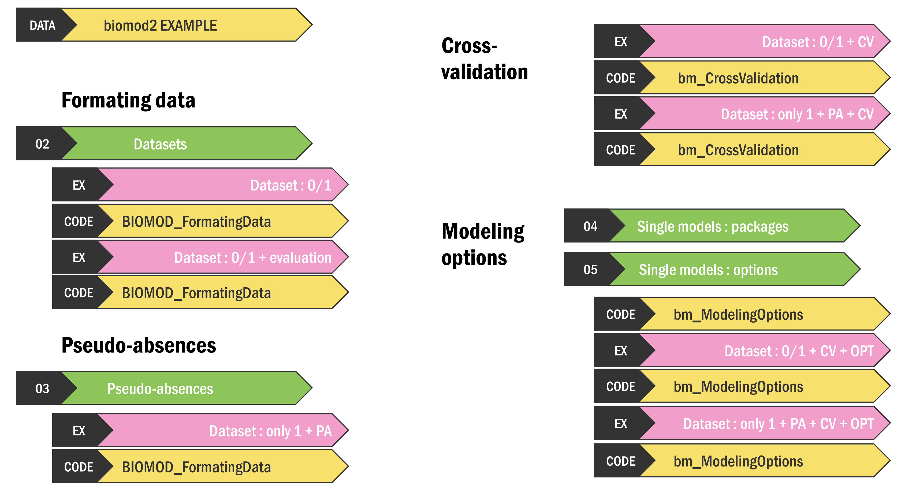

<link rel="stylesheet" href="https://use.fontawesome.com/releases/v5.0.13/css/all.css" integrity="sha384-DNOHZ68U8hZfKXOrtjWvjxusGo9WQnrNx2sqG0tfsghAvtVlRW3tvkXWZh58N9jp" crossorigin="anonymous">

### 2024: biomod2 team videos

*This video details all first steps of your biomod2 modeling, going from formating of your data, to defining of your modeling options, through pseudo-absences and cross-validation datasets.*

<iframe width="560" height="315" src="https://www.youtube.com/embed/ofAKTkDvmkg?si=hVKdPHnDLlRHpnld" title="biomod2 v4.2-6 tutorial 1" frameborder="0" allow="accelerometer; autoplay; clipboard-write; encrypted-media; gyroscope; picture-in-picture" allowfullscreen></iframe>

 

 

| Chapter                      | Theme                         | Timestamp |
| :--------------------------- | :-------------------------------- | ----: |
| Introduction to the package  |                                   |  0:00 |
|                              |  01. Functions hierarchy          |  2:28 |
|                              |  DATA. biomod2 example            |  3:54 |
| FORMATING DATA               |  02. Datasets                     |  4:14 |
|                              |  Dataset : 0/1                    |  7:07 |
|                              |  Dataset : 0/1 + evaluation       |  8:21 |
| PSEUDO-ABSENCES              |                                   |  9:08 |
|                              |  03. Pseudo-absences              |  9:39 |
|                              |  Dataset : only 1 + PA            | 13:05 |
| CROSS-VALIDATION             |  Dataset : 0/1 + CV               | 16:35 |
|                              |  Dataset : only 1 + PA + CV       | 18:39 |
| MODELING OPTIONS             |  04. Single models : packages     | 19:49 |
|                              |  05. Single models : options      | 20:26 |
|                              |  Dataset : 0/1 + CV + OPT         | 24:48 |
|                              |  Dataset : only 1 + PA + CV + OPT | 26:40 |

*Chapters can be directly accessed to through timestamps in the video description on YouTube.*

  

### 2020: Ecological Niche Modeling course

*This course forms part of the **Ecological Niche Modeling 2020 course**, a jointly-taught, open-access course designed to provide a broad introduction to the use of niche modeling and distribution modeling tools in the broader field of distributional ecology.* - A. Townsend Peterson

#### Introduction to `biomod2` package

<iframe width="560" height="315" src="https://www.youtube.com/embed/-IAdf8Vh6uY" title="Introduction to biomod2 package" frameborder="0" allow="accelerometer; autoplay; clipboard-write; encrypted-media; gyroscope; picture-in-picture" allowfullscreen></iframe>

#### Modeling single species

<iframe width="560" height="315" src="https://www.youtube.com/embed/QrwqhJgRbnY" title="Modelling single species" frameborder="0" allow="accelerometer; autoplay; clipboard-write; encrypted-media; gyroscope; picture-in-picture" allowfullscreen></iframe>

#### Modeling multiple species

<iframe width="560" height="315" src="https://www.youtube.com/embed/E2I5PSdwrG8" title="Modelling multiple species" frameborder="0" allow="accelerometer; autoplay; clipboard-write; encrypted-media; gyroscope; picture-in-picture" allowfullscreen></iframe>

#### `biomod2` specificities (pseudo-absences, variability)

<iframe width="560" height="315" src="https://www.youtube.com/embed/hEjhdURRy3o" title="biomod2 specifics" frameborder="0" allow="accelerometer; autoplay; clipboard-write; encrypted-media; gyroscope; picture-in-picture" allowfullscreen></iframe>

#### Interface (package `ShinyBiomod`)

<iframe width="560" height="315" src="https://www.youtube.com/embed/nhWPYeLhxoA" title="YouTube video player" frameborder="0" allow="accelerometer; autoplay; clipboard-write; encrypted-media; gyroscope; picture-in-picture" allowfullscreen></iframe>

